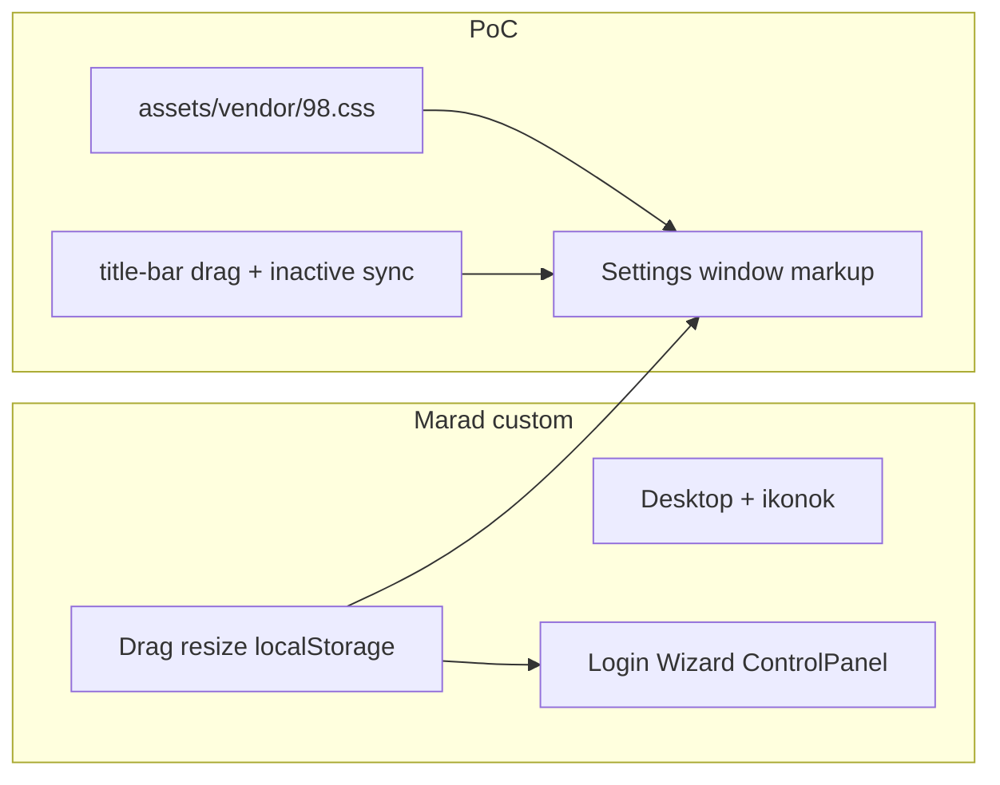

<!-- 056b6e39-9c3c-4f1c-96aa-7f62a86a2451 -->
---
todos:
  - id: "vendor-98css"
    content: "Vendor 98.css 0.1.21 (+ assets) under assets/vendor/; link in index.html before main.css"
    status: completed
  - id: "settings-html"
    content: "Remap #window-settings to title-bar / window-body / field-row / fieldset / sunken-panel"
    status: completed
  - id: "js-bridge"
    content: "Drag on .title-bar; sync .title-bar.inactive with inverted .window.active"
    status: completed
  - id: "css-bridge"
    content: "Scope conflicting button/label/window rules; Settings layout + title icon; leave other windows alone"
    status: completed
  - id: "readme"
    content: "Note Settings PoC + vendored 98.css in README Status"
    status: completed
isProject: false
---
# 98.css Settings PoC (PR A)

## Cél

Bizonyítani, hogy 98.css és a saját desktop shell együttél: **csak** [`#window-settings`](index.html) kap 98.css ablak-chrome-ot és kontrollokat; login, wizard, Control Panel, ikonok, resize, localStorage maradnak a jelenlegi custom CSS/JS-en.

## 98.css behozatal

- Vendor: `98.css@0.1.21` → [`assets/vendor/98.css`](assets/vendor/98.css) (+ a dist által hivatkozott font/asset fájlok, ha vannak).
- [`../../index.html`](index.html): `98.css` link **előtt**, majd `main.css` (saját override-ok győzzenek ahol kell).
- Nincs build step, nincs npm a repo gyökerében.

## Settings HTML mapping

[`#window-settings`](index.html) jelenlegi `header` / `section` / custom bevel → 98.css:

```html
<div id="window-settings" class="window w750" draggable="true">
  <div class="title-bar">
    <div class="title-bar-text settings">Settings</div>
    <div class="title-bar-controls">
      <button aria-label="Minimize"></button>
      <button aria-label="Maximize" disabled></button>
      <button aria-label="Close"></button>
    </div>
  </div>
  <div class="window-body">
    <!-- kétoszlopos tartalom: fieldset + sunken panel -->
  </div>
</div>
```

Tartalom:

- Checkboxok: `field-row` + `input` + `label` (98.css minta); `postlabel` / kettőspont-szabály nélkül.
- Group: meglévő `fieldset` + `legend` „General”.
- Jobb oldal: `sunken-panel` (vagy 98.css-kompatibilis sunken keret) a lorem szövegnek.
- Eltávolítandó erről az ablakról: `outerbevel`, saját `header`/`section`/`buttons`/`innerbevel-inverse`.

Login / wizard / Control Panel HTML **nem** változik ebben a PR-ben.

## Minimális JS híd (nem teljes D fázis)

[`../../assets/script/main.js`](assets/script/main.js) drag handle jelenleg:

```681:686:assets/script/main.js
      const header = event.target.closest('header');
      const interactive = event.target.closest('button, a, input, select, textarea, label');

      if (!header || !win.contains(header) || interactive) {
        return;
      }
```

PoC-hoz:

1. Drag: `closest('header, .title-bar')` — Settings húzható marad.
2. Aktív ablak: megmarad `.window.active` (localStorage + meglévő logika). Hozzáadás: aktiváláskor / clear-nél a window gyerek `.title-bar`-on `.inactive` toggle (**fordított** logika, 98.css szerint). Csak title-bar-os ablakokra hat; a többi ablak viselkedése változatlan.

Resize, ikon grid, feature panel JS érintetlen.

## CSS: konfliktusok elkerülése, nem takarítás

[`../../assets/style/main.css`](assets/style/main.css) — célzott PoC override-ok, **nem** a teljes chrome kiszedése (az E fázis):

- Globális `button` bevel és `label:not(.postlabel)::after` **ne** törje a Settings 98.css kontrolljait: szűkítés `#window-settings`-en kívülre, vagy Settings-en belüli reset.
- `.window` saját bevel/padding ne írja felül a Settings 98.css chrome-ját: `#window-settings` (vagy későbbi `.window--98`) mentesítése a custom window border/background-image alól.
- Title ikon: kis custom szabály `.title-bar-text.settings` (16×16 settings.gif), mint a régi `h3.settings`.
- Kétoszlopos layout: rövid flex a Settings body-ra (saját layout marad, 98.css nem ad desktop gridet).
- Desktop / ikon / Control Panel / login / wizard stílusok változatlanok.

## README

Egy sor a Status alatt: 98.css vendorolva; Settings PoC; többi ablak még custom chrome.

## Explicit nem-cél (A PR)

- Login, wizard, Control Panel migráció (B/C)
- Teljes JS szelektor-refaktor (D)
- Custom bevel/title-bar CSS törlése (E)
- Vizuális pixel-perfect finomhangolás (F)


