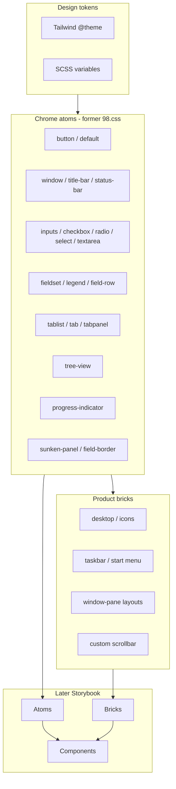

<!-- d6fbe44e-7b03-45fc-b258-d0c0e3c48f15 -->
---
todos:
  - id: "vite-tw-sass"
    content: "Add Vite, Sass, Tailwind v4; wire index.html + npm scripts"
    status: completed
  - id: "tokens-theme"
    content: "Define Win98/WebHemi design tokens in @theme + SCSS variables"
    status: completed
  - id: "chrome-atoms"
    content: "Port full 98.css surface into SCSS atoms (buttons, window, forms, tabs, tree, progress, …)"
    status: pending
  - id: "drop-98css"
    content: "Remove npm 98.css dependency once visual/markup parity is verified"
    status: pending
  - id: "split-product"
    content: "Move product CSS (desktop, toolbar, layouts, scrollbar) into SCSS partials on top of chrome"
    status: pending
  - id: "theme-utils"
    content: "Migrate demo utilities (w*/mxh*/justify*) to Tailwind theme keys"
    status: pending
  - id: "docs-inventory"
    content: "Update README; document atom catalog + Storybook mapping in var/plan/"
    status: pending
isProject: true
---
# Sass + Tailwind style system (own Win98 chrome)

## Progress

- **Step 1 (done):** Vite + Tailwind v4 + Sass scaffold. Entry is [`assets/style/main.css`](assets/style/main.css) (Tailwind theme+utilities → `98.css` → tokens → [`product.scss`](assets/style/product.scss)). `npm run dev` / `build` / `preview`. `cssMinify: false` until 98.css is dropped (`@media (not(hover))` breaks lightningcss minify). Preflight omitted so 98.css chrome is not reset.
- **Step 2 (done):** Design tokens in [`assets/style/abstract/tokens.css`](assets/style/abstract/tokens.css) (`:root`, after 98.css so we own the vars). Tailwind `@theme` bridge in `main.css` (colors, `font-webhemi`, window size scale). Bevel mixins in [`assets/style/abstract/_bevel.scss`](assets/style/abstract/_bevel.scss) for the chrome port. Note: tokens are plain CSS — importing SCSS partials from the `.css` entry mangled `//` comments and dropped `:root`.

## Decisions (confirmed)

1. **HTML style: semantic components (1A)** — keep stable class names for Storybook atoms; Tailwind for tokens and thin `@apply`, not utility-first markup.
2. **Build: Vite + Tailwind v4 + Sass (2A)**.
3. **Chrome ownership (new):** do **not** keep `98.css` as a long-term dependency. **Re-implement the full 98.css surface** in our SCSS as the atom foundation (everything the library ships, not only what the demo uses today), so Storybook can compose atoms → bricks → components without fighting an external chrome layer.

Copyright / trade dress is explicitly out of this discussion (per product owner); this plan is developer architecture only.

## Why rewrite the full chrome now

- Storybook atoms need a **single owned API** (button, window, field-row, tabs, …). Sitting on npm `98.css` means overrides, cascade fights, and a foreign class contract.
- The demo already overrides fonts, `.sunken-panel` color, and layout around 98.css. That debt grows with every product feature.
- `98.css` is small (~1k lines source, MIT). Porting **all** of it is bounded work; waiting until “we use more of it” only means more override CSS to unwind later.
- Custom scrollbar, taskbar, desktop icons, pane layouts stay **product layer** on top of chrome atoms — same as today, but without an external base.

## Target architecture



### Layering rules

| Layer | Owns | Examples |
|-------|------|----------|
| Tokens | Color, elevation (bevel), font, control sizes | `silver`, `navy`, `--bevel-raised`, `font-webhemi` |
| Chrome atoms | Faithful Win98 control look + markup contract | `.window`, `button`, `.field-row`, `[role=tab]` |
| Product bricks | WebHemi shell / admin UX | `#toolbar`, `.icon-panel-layout`, `.scrollable` + JS scrollbar |
| Demo / app | Composition only | `index.html` windows |

Tailwind: tokens + utilities (widths, justify, gaps). **Do not** `@apply` complex bevel/chrome into one-off utilities — chrome stays named SCSS atoms.

## Chrome atom catalog (port all of 98.css)

Source of truth while porting: [node_modules/98.css/style.css](node_modules/98.css/style.css) + [docs](https://jdan.github.io/98.css/). Keep **compatible class/markup names** initially so the demo keeps working; rename only later if Storybook needs a `wh-` prefix.

| Atom group | Selectors / patterns |
|------------|----------------------|
| Typography / reset | base font, `u`, headings used by 98 |
| Button | `button`, `.default`, active/disabled/focus |
| Window shell | `.window`, `.title-bar`, `.title-bar-text`, `.title-bar-controls` (+ min/max/restore/help/close), `.window-body`, `.status-bar`, `.status-bar-field` |
| Grouping | `fieldset`/`legend`, `.field-row`, `.field-row-stacked` |
| Forms | text/password inputs, checkbox, radio, `select`, `textarea` |
| Slider | `input[type=range]`, `.has-box-indicator`, `.is-vertical` |
| Tabs | `[role=tablist]`, `[role=tab]`, `.window[role=tabpanel]`, `.multirows` |
| Tree | `ul.tree-view` (+ nested) |
| Surfaces | `.sunken-panel`, `.field-border`, `.field-border-disabled`, `.status-field-border` |
| Progress | `.progress-indicator`, `.segmented` |
| Misc | `.vertical-bar`, etc. as in upstream |

**Fonts:** stop using 98.css Pixelated MS Sans as default; WebHemi Sans (already in demo) becomes the chrome font via tokens. Optionally keep pixel font as an opt-in theme later.

**Bevel system:** extract shared raised/sunken border mixins (box-shadow recipes from 98.css) into `_bevel.scss` so buttons, windows, and inputs share one language.

## SCSS file map

```
assets/style/
  main.css                # Tailwind @theme + import chain
  abstract/
    tokens.css            # :root design tokens (plain CSS; loaded from main.css)
    _bevel.scss           # raised / sunken / field border mixins
    _index.scss           # @forward bevel (for chrome @use)
  chrome/                 # full former-98.css surface
    _typography.scss
    _button.scss
    _window.scss
    _forms.scss
    _grouping.scss
    _tabs.scss
    _tree-view.scss
    _surfaces.scss
    _progress.scss
    _slider.scss
    _index.scss           # @use all chrome
  product/
    _base.scss            # html/body.dashboard shell
    _desktop.scss
    _toolbar.scss
    _layouts.scss         # icon/wizard/heading/dialog-panel-layout
    _primitives.scss      # columns, stack, field-column (@apply where thin)
    _scrollbar.scss       # custom Win98 scrollbar (JS-coupled)
    _index.scss
```

Entry: tokens → Tailwind → chrome → product.

## Vite + npm setup

- Add: `vite`, `sass`, `tailwindcss`, `@tailwindcss/vite`.
- Scripts: `"dev": "vite"`, `"build": "vite build"`, `"preview": "vite preview"`.
- [index.html](index.html) is Vite root; stylesheet → `/assets/style/main.scss`.
- During port: may temporarily `@import` npm `98.css` **behind a flag** or side-by-side for diffing; **remove `98.css` from package.json** when chrome parity is signed off.
- Keep `assets/` paths usable for later Storybook.

## Tailwind theme (minimal)

Via `@theme` in tokens:

- colors: `desktop` (#008284), face/silver, navy, window text, highlight
- font: `webhemi`
- widths: map `.w175`…`.w1024`, max-heights `.mxh240` / `.mh500` to named theme keys

## Product CSS (after chrome)

Same split as before for [main.css](assets/style/main.css) product rules: desktop, window shell JS helpers (`.resizable`, `.bounded`), toolbar, layouts, scrollbar. Utilities like `.justify-*` / `.w*` migrate to Tailwind theme classes in HTML or thin `@apply` wrappers.

## Implementation order

1. **Scaffold** Vite + Sass + Tailwind; demo still builds (can still pull 98.css once).
2. **Tokens + bevel mixins** — shared raised/sunken language.
3. **Port chrome atoms** group by group (button → window → forms → …), visual check against 98.css docs / demo.
4. **Cut over:** remove npm `98.css`; demo uses only our chrome.
5. **Split product** SCSS from current `main.css` onto chrome.
6. **Migrate** size/justify utilities to Tailwind theme.
7. **Document** atom list + suggested Storybook hierarchy in this plan / README.

## Storybook readiness (not implementing Storybook yet)

Suggested future story map (for when Storybook lands):

- **Atoms:** Button, TextBox, Checkbox, Radio, Select, Window, TitleBar, StatusBar, Tab, TreeItem, Progress, SunkenPanel
- **Bricks:** FieldRow, Fieldset, TabList, TitleBarControls, ScrollableRegion
- **Components:** DialogWindow, IconPanelWindow, WizardWindow, Taskbar, StartMenu, DesktopIcon

Chrome SCSS file boundaries should match atom boundaries so each story can import a partial or a generated CSS chunk later.

## Out of scope (this pass)

- Storybook app package / CI
- Symfony / Next integration
- Renaming JS-coupled product classes (`.scrollable-viewport`, `.sb-*`) except if required by the chrome cutover
- Changing demo features (new windows, etc.)

## Risk notes

- Pixel-perfect port takes discipline; use 98.css docs pages and the live demo as regression targets after each atom group.
- Tabs/tree/slider are unused in the current demo but **still ported** so the atom catalog is complete for Storybook.
- Our custom scrollbar replaces native bars; do not expect 98.css “native scrollbar skin” to be the product scrollbar — keep [scrollbar.js](assets/script/scrollbar.js) as the brick.
- Cascade: product overrides chrome intentionally (e.g. gray `.sunken-panel`); document overrides next to the product rule.

## Developer verdict

Rewriting the full chrome **now** is the right call if the goal is a Storybook design system: one owned stack, no forever-overrides, clear atom boundaries. Cost is upfront porting (~1k lines + fonts/assets organization), not ongoing architecture debt. Keeping npm `98.css` would be faster for the demo alone and worse for the system you described.
