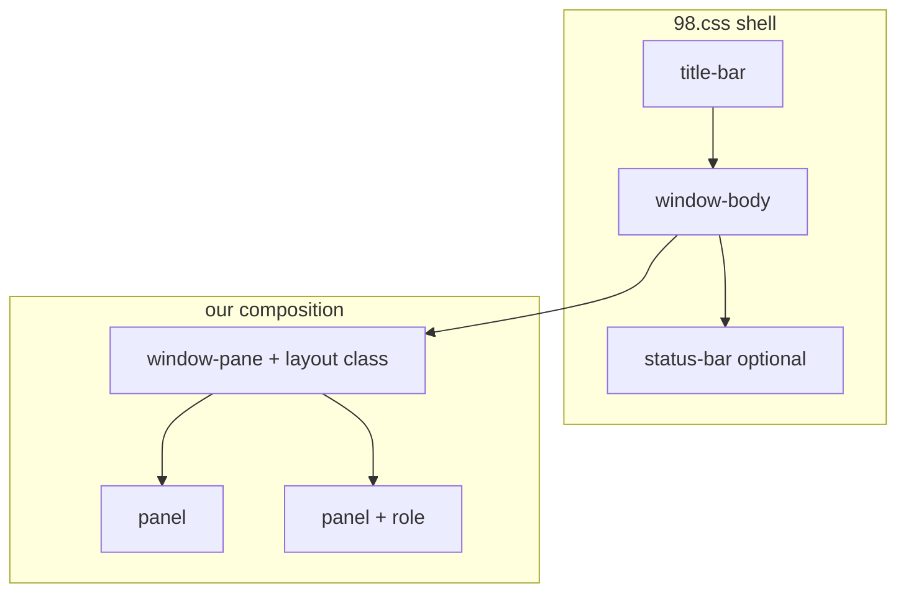

<!-- 44061456-1e34-4cb5-b386-8a9289685545 -->
---
todos:
  - id: "icon-panel"
    content: "Introduce window-pane/.panel contract; rename control-panel → icon-panel-layout; migrate CP HTML/CSS/JS"
    status: completed
  - id: "wizard-panel"
    content: "Refactor setup wizard to wizard-panel-layout with shared groove/bleed rules"
    status: completed
  - id: "dialog-panel"
    content: "Wrap auth window in dialog-panel-layout; remove ID-scoped layout CSS where possible"
    status: completed
  - id: "settings-pane"
    content: "Wrap settings in window-pane; keep columns/stack as in-panel utilities"
    status: completed
  - id: "shell-toplevel"
    content: "Scope window shell JS to top-level .window only (nested tab panels safe)"
    status: completed
isProject: false
---
# Window pane layout system

## Verdict

**Solvable without fighting 98.css.** The shell (title bar / body / status bar / controls) stays 98.css. Our CSS only owns: (1) how `.window-pane` fills a resizable body, (2) a small set of named layouts that arrange direct `.panel` children, (3) thin panel role modifiers. Window IDs (`#window-control-panel`, etc.) should stop driving layout.



## Target structure (from [structure.html](structure.html))

Every window:

```html
<div class="window …">
  <div class="title-bar">…</div>
  <div class="window-body">
    <div class="window-pane <layout> [field-border] [scrollable]">
      <div class="panel …">…</div>
      …
    </div>
  </div>
  <div class="status-bar">…</div>  <!-- when the layout requires it -->
</div>
```

**Contract**

| Layer | Responsibility |
|--------|----------------|
| `.window` / `.title-bar` / `.window-body` / `.status-bar` | 98.css chrome only |
| `.window-pane` | One content host under body: fill height in resizable windows, optional `field-border` / `scrollable` |
| `*-layout` on the pane | Arrangement of **direct** `.panel` children (row / column / grid, fixed vs flex, bleed, grooves) |
| `.panel` | Generic region; optional role classes for look/behavior inside a layout |
| Inside panels | Prefer 98.css (`field-row`, `fieldset`, `sunken-panel`, tabs) plus small utilities (`.columns`, `.stack`, `.justify-*`) |

Layouts are **composition recipes**, not feature names. One window type can appear many times; only markup + layout class changes.

## Layout catalog (v1)

Aligned with [structure.html](structure.html); drop example-bound names.

1. **`icon-panel-layout`** (replaces `.control-panel-layout`)
   - Two panels: info (fixed width) + `.panel.icon-list` (flex grow).
   - Pane typically `field-border scrollable`; status bar expected by convention.
   - Scrollbar: host becomes grid; flex row moves to `.scrollable-viewport` (same pattern as today).

2. **`wizard-panel-layout`** (replaces `.wizard-layout` + `.wizard-actions` sibling)
   - Grid/flex: banner + text side-by-side, actions panel under both.
   - Shared Win98 groove separators between panels; first/last exceptions as in the comments (use **1px**, not rem).
   - Bleed via layout CSS (absorb today’s `.stretched` / body margin fights) instead of one-off wrappers.

3. **`heading-panel-layout`**
   - Column of panels; first (graphic) bleeds; grooves between panels.
   - Content panel may hold fieldsets, tabs, etc. Document nested 98.css `.window[role=tabpanel]` as **inner chrome only**.

4. **`dialog-panel-layout`** (structure’s “some-other-layout”)
   - Compact dialog/login/alert: icon / message / button row as panels (or a simple column of panels).
   - Used to wrap today’s auth window into the same pane contract.

**Settings demo:** not a fifth window layout yet. Map to `heading-panel-layout` **or** a single `.window-pane` whose panels use existing inner `.columns` / `.stack` / `.sunken-panel`. Keep `.columns` / `.stack` as **in-panel** primitives, not competing pane layouts.

## What becomes general vs what stays content-specific

**Rename / generalize (CSS + HTML)**

- `.control-panel-layout` → `.icon-panel-layout`
- `.feature` → `.panel` (+ keep visual rules as `.icon-panel-layout > .panel:first-child` or `.panel.info` if a role name helps JS)
- `.box-icon-list` → `.panel.icon-list`
- `.wizard-layout` / `.wizard-banner` / `.wizard-info` / `.wizard-actions` → `.wizard-panel-layout` + `.panel` (banner/info/actions via order or small modifiers like `.panel.banner`)
- Remove `#window-control-panel` / `#window-authentication` layout rules from [assets/style/main.css](assets/style/main.css)

**Keep as utilities (not layouts)**

- Size helpers (`.w332`, `.w750`, …), `.justify-*`, `.field-column`, `.columns`, `.stack`, `.stretched` only if still needed after bleed is encoded in layouts
- Desktop `.icon` / `.icon-list` (desktop surface ≠ in-window `.panel.icon-list`)

**98.css first**

- Borders: `field-border`, `sunken-panel` where appropriate
- Forms: `field-row`, `fieldset` / `legend`
- Do not reimplement title bar, buttons, status bar fields

## JS impact ([assets/script/main.js](assets/script/main.js))

- Feature preview: stop targeting `.feature` / `.box-icon-list`; use `.icon-panel-layout` + `.panel.icon-list` and the sibling info `.panel` (e.g. `.panel.info` or `:first-child`).
- **Nested tab windows:** today `dashboard.querySelectorAll('.window')` and `closest('.window')` will treat inner tabpanel windows as shell windows. Scope shell actions to **top-level** windows only (`body.dashboard > .window` or equivalent) before heading/tab demos land.
- Scrollbar host remains `.scrollable` on the pane; layout CSS must stay viewport-aware (generalize current control-panel scrollbar rules to `.icon-panel-layout`).

## Feasibility notes / risks

| Topic | Assessment |
|--------|------------|
| Unify under `.window-pane` | Straightforward; resizable fill already assumes it ([main.css](assets/style/main.css) ~213–218) |
| Drop example-type class names | Easy rename + selector updates |
| Many windows of each layout | CSS is class-based; no blockers |
| Wizard/heading grooves + bleed | One shared groove helper under those layouts; encode negative margins in layout, not per-window |
| Custom scrollbar + multi-panel row | Already proven for CP; must copy pattern to `icon-panel-layout` generically |
| Nested 98.css tabs | Markup OK; shell JS must ignore nested `.window` |
| Status bar “mandatory” for icon layout | Convention/docs only — CSS cannot force a sibling |

## Suggested implementation order (after approval)

1. Introduce base `.window-pane` + `.panel` contracts; rename CP to `icon-panel-layout` and migrate that demo end-to-end (HTML/CSS/JS).
2. Refold wizard into `wizard-panel-layout` with shared grooves/bleed.
3. Wrap auth into `dialog-panel-layout`; strip ID-scoped form CSS where possible.
4. Put settings behind a pane (heading or plain pane + in-panel columns); no new layout unless needed.
5. Harden top-level-only window shell queries for future tabs.

Out of scope for the first pass: inventing every future layout, rewriting 98.css, or enforcing status-bar presence in code.
